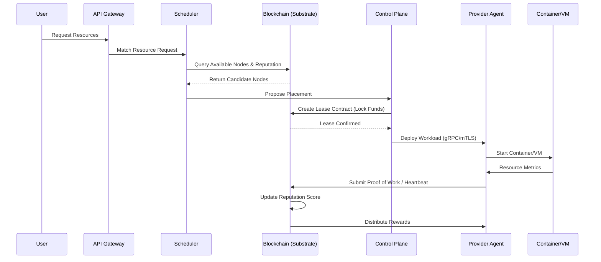

# OpenInfra Network - Technical Architecture Review

## 1. Executive Summary

**Vision**
OpenInfra Network aims to democratize cloud computing by creating a decentralized marketplace for compute and storage. By decoupling resource provision from centralized entities, it empowers individual providers to monetize their hardware while offering users a resilient, cost-effective, and transparent infrastructure.

**Objectives**
- Create a trustless environment for resource leasing.
- Implement a meritocratic reputation system based on actual performance.
- Ensure high availability through a distributed control plane.
- Provide secure, isolated environments for diverse workloads.

**General Architecture**
The system follows a layered approach: a **Blockchain Layer** (Substrate) for identity and settlement, a **Control Plane** (Go) for orchestration and scheduling, and a **Provider Agent** (Rust) for low-level hardware management. Communication is standardized via **Protocol Buffers** and **gRPC**.

**Current State**
The project has completed its architecture phase. Core components (Agent, Control Plane, Runtime) are defined. Interface contracts (Proto, Shared Models) are established. The project is ready for the Prototype (MVP) implementation phase.

---

## 2. Architecture Globale

### Components & Roles

| Component | Role | Primary Tech | Interaction |
| :--- | :--- | :--- | :--- |
| **Blockchain** | Trust Anchor | Substrate | Stores node registry, reputation, and manages rewards. |
| **Control Plane** | Orchestrator | Go | Manages users, handles API requests, and coordinates deployments. |
| **Scheduler** | Matchmaker | Go | Matches workload requirements to provider capabilities & reputation. |
| **Provider Agent** | Resource Manager | Rust | Manages local virtualization (KVM/Docker), monitors health. |
| **Shared Protocol** | Contract Layer | Protobuf | Ensures type-safety and communication standards across all languages. |
| **Database** | Persistence | PostgreSQL | Stores user metadata, billing history, and extended node info. |
| **Cache** | State Store | Redis | Caches active leases and scheduler lookups for low latency. |
| **API Gateway** | Entry Point | Go / gRPC-Gateway | Exposes REST/gRPC endpoints to end-users. |

**Interactions**:
The **API Gateway** receives requests $\rightarrow$ **Scheduler** finds a provider via **Blockchain** registry $\rightarrow$ **Control Plane** creates a lease $\rightarrow$ **Provider Agent** executes the workload $\rightarrow$ **Metrics** flow back to the **Blockchain** to update **Reputation**.

---

## 3. Workflow Complet

### Workload Lifecycle

---

## 4. Validation des Interfaces

**Analysis of Consistency**:
- **Shared-models $\leftrightarrow$ Protobuf**: High consistency. The use of Protocol Buffers as the "source of truth" allows seamless translation between Go (Control Plane) and Rust (Agent).
- **APIs $\leftrightarrow$ gRPC**: Standardized. The API Gateway acts as a transparent proxy.
- **Events $\leftrightarrow$ Blockchain**: The Event Model aligns with Substrate's pallet events, ensuring that state changes on-chain are detectable by the Control Plane.
- **Blockchain $\leftrightarrow$ Protocol**: The interaction is handled via JSON-RPC, which is decoupled from internal gRPC calls, preventing runtime dependencies between the chain and the agent.

**Potential Inconsistencies**:
- *Risk*: Discrepancy between the "Requested Spec" in the API and the "Reported Spec" in the Agent's Rust models.
- *Requirement*: Strict versioning of `.proto` files is mandatory to avoid breaking changes during rolling updates.

---

## 5. Analyse des Choix Techniques

| Tech | Pros | Cons | Alternatives |
| :--- | :--- | :--- | :--- |
| **Rust** | Memory safety, C-like speed, minimal runtime. | Steep learning curve, slower compile times. | C++, Go |
| **Go** | Fast development, great concurrency (goroutines), cloud-native. | GC pauses, less strict typing than Rust. | Java, Rust |
| **Substrate** | Modular blockchain, customizable pallets, Wasm. | Complex architecture, steep learning curve. | Cosmos SDK, Ethereum (L2) |
| **PostgreSQL** | ACID compliance, relational integrity, mature. | Scaling writes requires complexity (Sharding). | MongoDB, CockroachDB |
| **Redis** | Extremely low latency, versatile data types. | Volatile by default, memory-bound. | Memcached |
| **gRPC** | Strong typing, bidirectional streaming, performance. | Less browser-friendly (needs gateway). | REST/JSON, GraphQL |
| **Docker** | Standardized isolation, huge ecosystem. | Higher overhead than Wasm/Firecracker. | Firecracker, Kata Containers |
| **Prometheus** | Industry standard for metrics, powerful query lang. | Pull-based (can be hard for NAT'd agents). | VictoriaMetrics, InfluxDB |
| **Ed25519** | Fast, secure, small keys. | Not as widely used in legacy systems. | RSA, ECDSA |
| **mTLS** | Strong mutual identity verification, encrypted. | Certificate lifecycle management overhead. | JWT / API Keys |

---

## 6. Analyse des Risques

| Risk | Category | Level | Mitigation |
| :--- | :--- | :--- | :--- |
| **Byzantine Providers** | Security | **High** | Implement Verifiable Computation (ZK-Proofs) or TEEs (Intel SGX). |
| **State Bloat** | Scalability | **Medium** | Implement state pruning on the blockchain and off-chain indexing. |
| **Node Churn** | Performance | **High** | Erasure coding for storage and automated failover scheduling. |
| **mTLS Cert Leak** | Security | **Medium** | Automated short-lived certificate rotation via Vault/SPIFFE. |
| **Scheduling Bottleneck** | Scalability | **Medium** | Implement a distributed scheduler (hierarchical scheduling). |
| **Governance Deadlock** | Governance | **Low** | Define a clear on-chain voting mechanism with weighted reputation. |

---

## 7. Roadmap

### v0.1: Proof of Concept (PoC)
- Basic Blockchain Registry (Substrate).
- Simple Agent (Rust) starting a Docker container.
- Basic Scheduler matching by CPU/RAM.
- Manual lease creation.

### v0.2: Functional Prototype
- Automated gRPC orchestration (Control Plane $\leftrightarrow$ Agent).
- Real-time heartbeat and basic reputation updates.
- Integration of WireGuard for network connectivity.
- PostgreSQL for user management.

### v0.3: Beta Network
- Multi-provider support with dynamic scheduling.
- Automated reward distribution on-chain.
- Integrated observability (Prometheus $\rightarrow$ VictoriaMetrics).
- Basic storage leasing (ZFS).

### v1.0: Production Ready
- TEE support (Intel SGX/AMD SEV) for secure workloads.
- Advanced GPU scheduling and virtualization.
- Full Decentralized Governance (DAO).
- Marketplace for pre-configured workload templates.

---

## 8. Architecture Cible (Long Term)

**The Global Distributed Cloud**
- **Compute**: True hybrid compute (VMs, Containers, and Wasm) with GPU acceleration (CUDA/ROCm virtualization).
- **Storage**: Global distributed filesystem combining local ZFS with a decentralized object store (IPFS/Filecoin integration).
- **Edge Computing**: Low-latency execution by placing workloads geographically close to the end-user.
- **AI Integration**: Dedicated "AI-Slices" where providers offer optimized GPU clusters for LLM training and inference.
- **Marketplace**: A self-service portal where users buy specialized "Resource Packs" (e.g., "High-RAM for Databases").
- **Governance**: Purely decentralized management of network parameters via tokenized voting.

---

## 9. Recommandations

**1. Components to Strengthen**
- **The Scheduler**: Move from a simple "best-fit" to a "cost-reputation-latency" weighted algorithm.
- **The Agent**: Ensure the Rust agent is fully asynchronous to handle hundreds of concurrent containers without blocking.

**2. Simplifications**
- **Database**: For the MVP, reduce the reliance on Redis and use PostgreSQL JSONB for temporary state to reduce infrastructure complexity.
- **Blockchain**: Use a pre-existing Substrate template (e.g., Asset Hub) rather than building all pallets from scratch.

**3. Optimizations**
- **Protobuf Compilation**: Implement a shared CI pipeline that generates client libraries for Go and Rust automatically from a single `.proto` repo.
- **Networking**: Explore eBPF for faster packet routing within the Provider Agent.

**4. Defer to Post-MVP**
- Full-scale TEE (Trusted Execution Environments).
- Complex GPU slicing/virtualization.
- Advanced DAO governance.

---

## 10. Conclusion

**Overall Evaluation**
The OpenInfra Network architecture is **highly coherent** and leverages the right tools for the right tasks (Rust for system level, Go for orchestration, Substrate for trust). The separation of concerns is clear, and the use of strong contracts (Protobuf) mitigates the risk of polyglot development.

- **Maturity**: Architecture stage complete $\rightarrow$ Ready for Development.
- **Feasibility**: High, as it relies on proven technologies (KVM, Docker, WireGuard).
- **Main Challenge**: The "Trust" problem—verifying that a provider actually provided the resources they claimed without introducing too much overhead.

**Final Status: VALIDATED**
