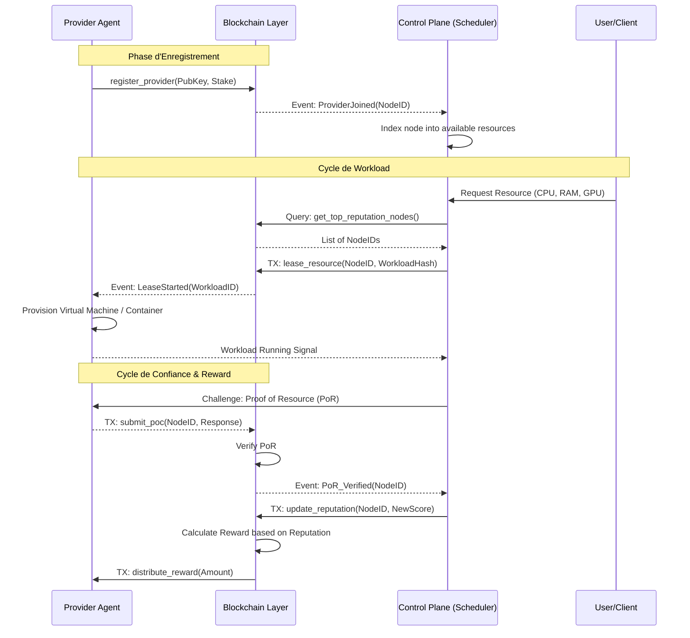

# Diagramme des Interactions OpenInfra Network

```mermaid
sequenceDiagram
    participant Agent as Provider Agent
    participant BC as Blockchain Layer
    participant CP as Control Plane (Scheduler)
    participant User as User/Client

    Note over Agent, BC: Phase d'Enregistrement
    Agent->>BC: register_provider(PubKey, Stake)
    BC-->>CP: Event: ProviderJoined(NodeID)
    CP->>CP: Index node into available resources

    Note over User, Agent: Cycle de Workload
    User->>CP: Request Resource (CPU, RAM, GPU)
    CP->>BC: Query: get_top_reputation_nodes()
    BC-->>CP: List of NodeIDs
    CP->>BC: TX: lease_resource(NodeID, WorkloadHash)
    BC-->>Agent: Event: LeaseStarted(WorkloadID)
    Agent->>Agent: Provision Virtual Machine / Container
    Agent-->>CP: Workload Running Signal

    Note over Agent, BC: Cycle de Confiance & Reward
    CP->>Agent: Challenge: Proof of Resource (PoR)
    Agent-->>BC: TX: submit_poc(NodeID, Response)
    BC->>BC: Verify PoR
    BC-->>CP: Event: PoR_Verified(NodeID)
    CP->>BC: TX: update_reputation(NodeID, NewScore)
    BC->>BC: Calculate Reward based on Reputation
    BC->>Agent: TX: distribute_reward(Amount)
```
