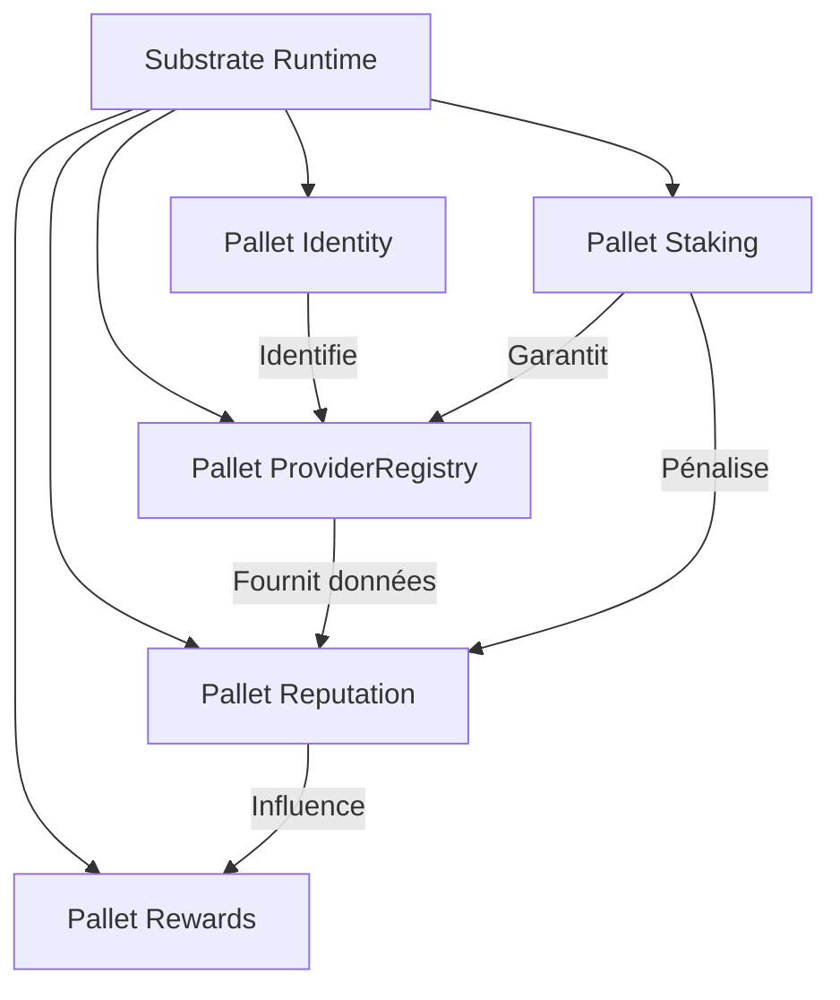

# Schéma des Modules Blockchain (Substrate Pallets)

### Description des Modules :
1. **Pallet Identity :** Gestion des clés publiques et mapping avec les identités humaines/organisations.
2. **Pallet ProviderRegistry :** Gestion du cycle de vie des nodes (Join, Leave, UpdateCaps).
3. **Pallet Reputation :** Moteur de scoring basé sur les preuves de validation.
4. **Pallet Staking :** Gestion du collatéral, verrouillage et slashing.
5. **Pallet Rewards :** Logique de distribution des tokens basée sur le score de réputation.
