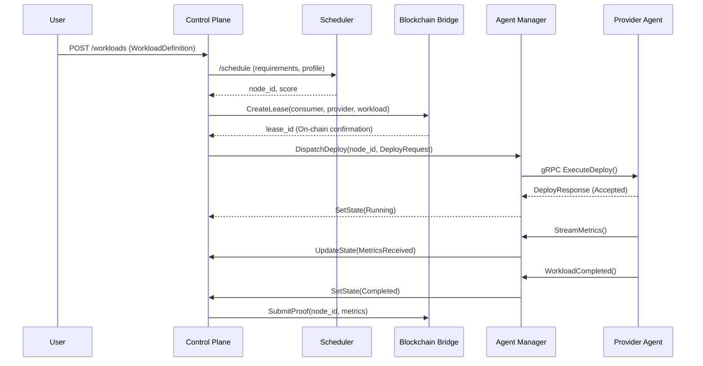

# Control Plane Architecture - OpenInfra Network

## 1. Overview
The Control Plane is the central orchestration hub. It translates high-level user requests into physical deployments by coordinating with the Scheduler, Blockchain Bridge, and Provider Agents.

### Core Architecture
The Control Plane is designed as a set of decoupled services:
- **API Gateway**: User-facing REST/GraphQL interface.
- **Orchestrator**: State machine managing the workload lifecycle.
- **Agent Manager**: Maintains gRPC tunnels and heartbeats with Provider Agents.
- **Blockchain Bridge**: Interface for lease management and reputation updates.
- **Persistence Layer**: Stores system state and audit logs.

---

## 2. Technology Choices

| Component | Technology | Reason |
| :--- | :--- | :--- |
| **Language** | Go | Concurrency (goroutines), performance, and strong gRPC support. |
| **API** | REST / gRPC | REST for users, gRPC for internal agent communication. |
| **Database** | PostgreSQL | Relational integrity for users, leases, and workload tracking. |
| **Cache** | Redis | High-frequency node status and heartbeat tracking. |
| **Message Bus**| NATS | Lightweight, high-performance event streaming for the state machine. |

---

## 3. API Specification

### 3.1 User API (REST)
- **POST `/auth/register`** $\rightarrow$ creates user identity.
- **POST `/workloads`** $\rightarrow$ Input: `WorkloadDefinition`. Output: `lease_id`.
- **GET `/workloads/{id}`** $\rightarrow$ returns current status, provider info, and metrics.
- **DELETE `/workloads/{id}`** $\rightarrow$ triggers termination on Provider Agent.

### 3.2 Internal API (gRPC - Agent Manager $\leftrightarrow$ Provider Agent)
- **`ReportHeartbeat`**: Unary signed liveness and resource update from Agent to Control Plane. Control commands use the separate Provider Agent service.
- **`ExecuteDeploy`**: Sends `DeployRequest` (Shared Model).
- **`TerminateWorkload`**: Command to stop a specific `workload_id`.

---

## 4. Database Schema

### Tables
1. **Users**: `id (PK), public_key, balance, created_at`
2. **Workloads**: `id (PK), user_id (FK), profile, requirements (JSONB), status, created_at`
3. **Leases**: `lease_id (PK), workload_id (FK), provider_id, state, start_time, end_time`
4. **NodeHealth**: `node_id (PK), last_seen, status, current_load (JSONB)`

---

## 5. Event-Driven Workflow (State Machine)

The Control Plane implements the following linear flow using the internal event bus:

1. **`WorkloadRequested`**: User submits `WorkloadDefinition`.
2. **`Scheduled`**: Scheduler returns `node_id` and `score`.
3. **`LeaseCreated`**: Blockchain Bridge confirms lease on-chain.
4. **`DeploySent`**: Agent Manager sends `DeployRequest` to Provider Agent.
5. **`Running`**: Provider Agent confirms workload start.
6. **`MetricsReceived`**: Monitoring stream updates `NodeHealth` and Workload state.
7. **`Completed`**: Workload ends; trigger `ReputationUpdate` via Blockchain Bridge.

---

## 6. Sequence Diagram: End-to-End Orchestration

