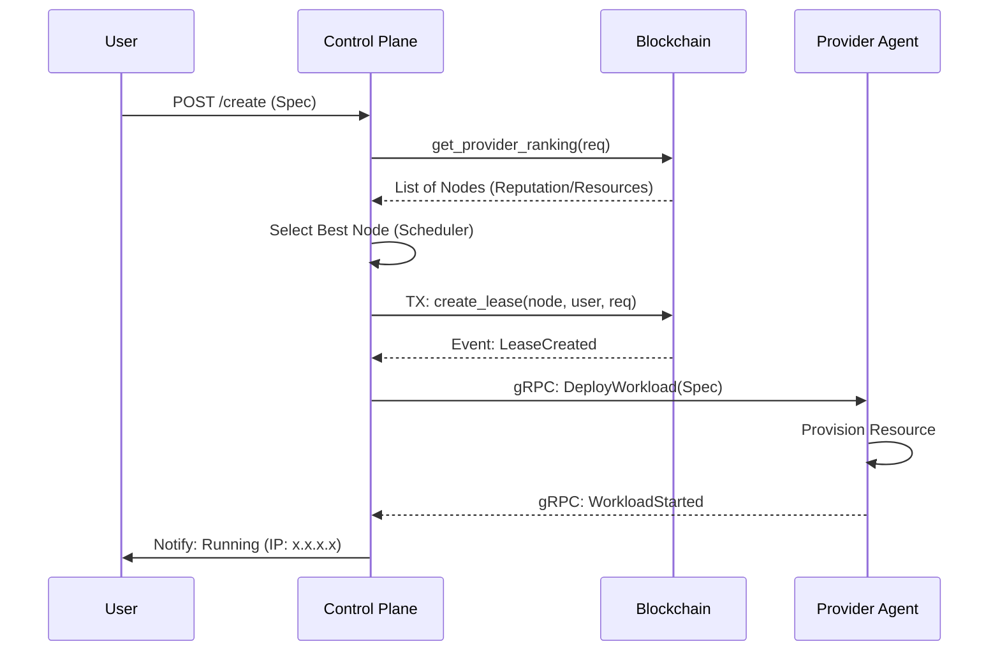
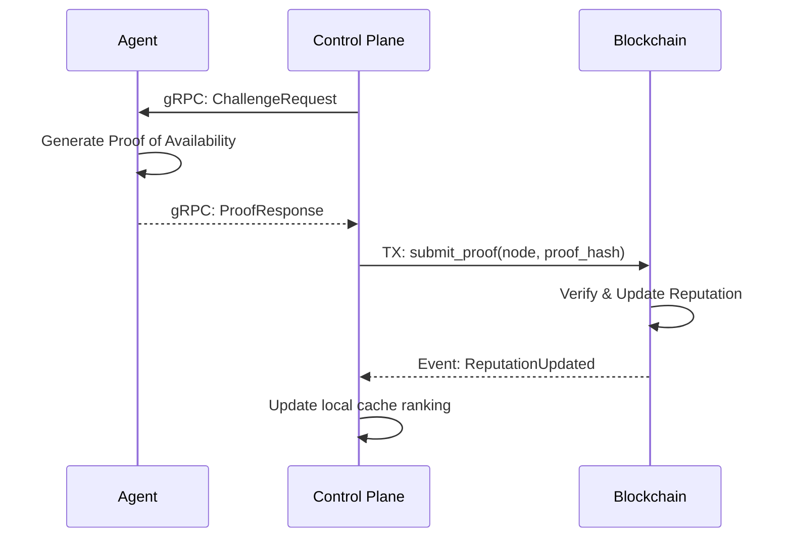

# Sequence Diagrams - Control Plane Flow

## 1. Cycle de Vie d'un Workload

```mermaid
sequenceDiagram
    participant User
    participant CP as Control Plane
    participant BC as Blockchain
    participant Agent as Provider Agent

    User->>CP: POST /create (Spec)
    CP->>BC: get_provider_ranking(req)
    BC-->>CP: List of Nodes (Reputation/Resources)
    CP->>CP: Select Best Node (Scheduler)
    CP->>BC: TX: create_lease(node, user, req)
    BC-->>CP: Event: LeaseCreated
    CP->>Agent: gRPC: DeployWorkload(Spec)
    Agent->>Agent: Provision Resource
    Agent-->>CP: gRPC: WorkloadStarted
    CP->>User: Notify: Running (IP: x.x.x.x)
```

## 2. Cycle de Preuve et Récompense

```mermaid
sequenceDiagram
    participant Agent
    participant CP as Control Plane
    participant BC as Blockchain

    CP->>Agent: gRPC: ChallengeRequest
    Agent->>Agent: Generate Proof of Availability
    Agent-->>CP: gRPC: ProofResponse
    CP->>BC: TX: submit_proof(node, proof_hash)
    BC->>BC: Verify & Update Reputation
    BC-->>CP: Event: ReputationUpdated
    CP->>CP: Update local cache ranking
```
