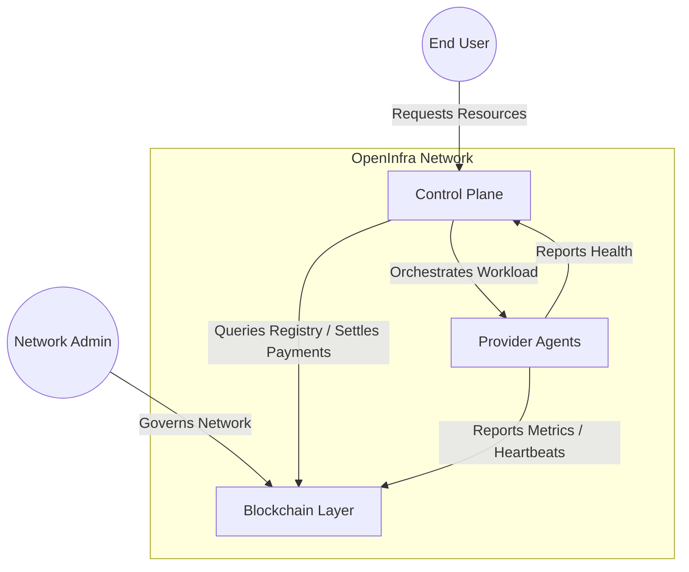
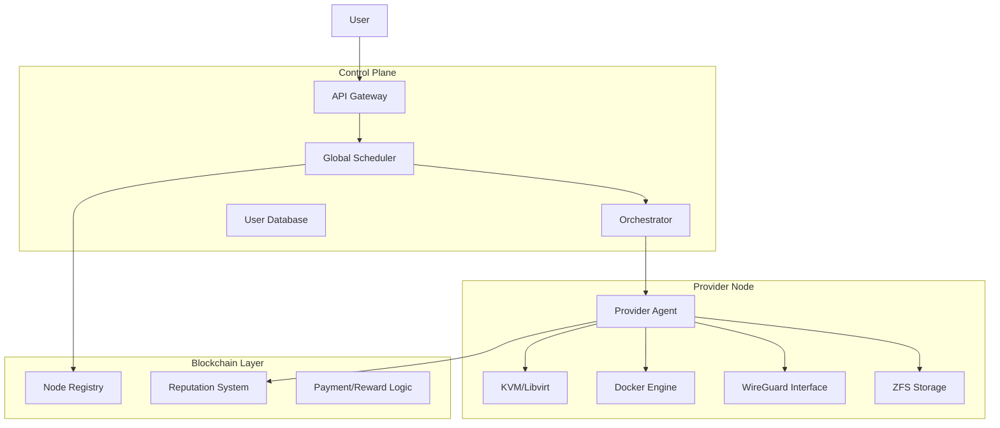

# C4 Diagram: Level 1 - System Context

```mermaid
graph TD
    User((End User))
    Admin((Network Admin))

    subgraph OpenInfra_Network [OpenInfra Network]
        CP[Control Plane]
        BChain[Blockchain Layer]
        PA[Provider Agents]
    end

    User -->|Requests Resources| CP
    Admin -->|Governs Network| BChain
    CP -->|Queries Registry / Settles Payments| BChain
    CP -->|Orchestrates Workload| PA
    PA -->|Reports Metrics / Heartbeats| BChain
    PA -->|Reports Health| CP
```

# C4 Diagram: Level 2 - Container Diagram

```mermaid
graph TD
    subgraph Control_Plane [Control Plane]
        API[API Gateway]
        Sched[Global Scheduler]
        Orch[Orchestrator]
        UserDB[User Database]
    end

    subgraph Blockchain_Layer [Blockchain Layer]
        Registry[Node Registry]
        Reputation[Reputation System]
        Payments[Payment/Reward Logic]
    end

    subgraph Provider_Node [Provider Node]
        Agent[Provider Agent]
        KVM[KVM/Libvirt]
        Docker[Docker Engine]
        WG[WireGuard Interface]
        ZFS[ZFS Storage]
    end

    User --> API
    API --> Sched
    Sched --> Registry
    Sched --> Orch
    Orch --> Agent
    Agent --> KVM
    Agent --> Docker
    Agent --> WG
    Agent --> ZFS
    Agent --> Reputation
```
