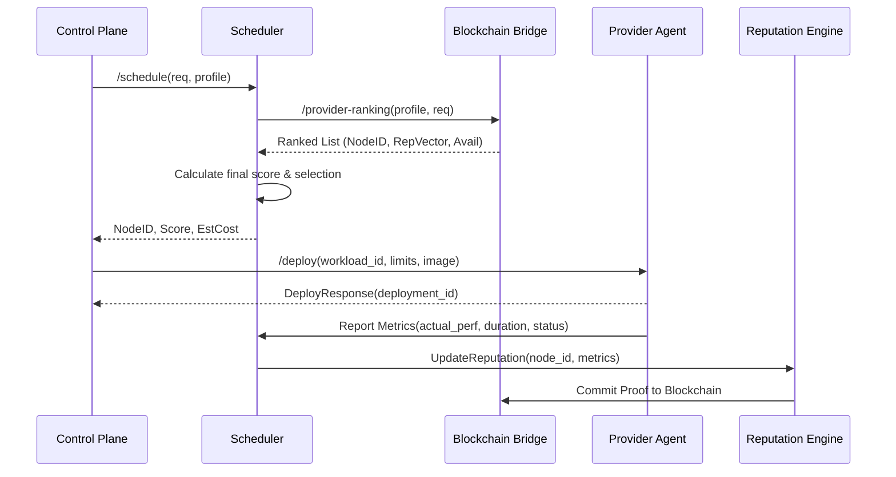

# Scheduler Specification v1.0 - OpenInfra Network

## 1. System Architecture
The Scheduler acts as the decision engine of the Control Plane. It matches Workload Requests to Provider Nodes by synthesizing real-time telemetry, blockchain-verified reputation, and pricing.

### Core Components
- **Scoring Engine**: Computes the utility score per node.
- **Node Registry**: Local cache of `NodeCapability` and `AvailableResources`.
- **Reputation Client**: Interface with the Blockchain Bridge for $\vec{R}$ vectors.
- **Feedback Processor**: Integrates post-workload metrics into the reputation loop.

---

## 2. Scoring Algorithm & Reputation Model

### 2.1 Reputation Vector ($\vec{R}$)
Format:
```json
{
  "compute": 0.0 to 1.0,
  "storage": 0.0 to 1.0,
  "network": 0.0 to 1.0,
  "availability": 0.0 to 1.0,
  "global": 0.0 to 1.0
}
```
- **Calculation**: Each dimension is a weighted moving average of successful vs failed tasks for that specific resource type.
- **Source**: Blockchain Layer (Proof-of-Execution/Proof-of-Availability).
- **Update Frequency**: Real-time upon workload completion; global recalculation every epoch.

### 2.2 Scoring Formula
$$Score = (W_{perf} \cdot S_{perf}) + (W_{rep} \cdot S_{rep}) + (W_{rel} \cdot S_{rel}) - (W_{cost} \cdot S_{cost})$$

**Profile Weights ($W_{rep}$ context):**
| Profile | Compute | Storage | Network | Avail |
| :--- | :---: | :---: | :---: | :---: |
| `compute_intensive` | 0.5 | 0.1 | 0.1 | 0.3 |
| `memory_intensive` | 0.4 | 0.2 | 0.1 | 0.3 |
| `storage_intensive` | 0.1 | 0.5 | 0.1 | 0.3 |
| `latency_sensitive` | 0.1 | 0.1 | 0.5 | 0.3 |

---

## 3. API Contracts

### 3.1 Control Plane $\leftrightarrow$ Scheduler
**POST `/schedule`**
- **Input**:
```json
{
  "workload_id": "string",
  "workload_profile": "compute_intensive | memory_intensive | storage_intensive | latency_sensitive",
  "requirements": { "cpu": float, "ram": int, "storage": int, "gpu": int },
  "constraints": { "max_latency": int, "min_reputation": float, "max_price": float }
}
```
- **Output**:
```json
{
  "node_id": "string",
  "score": float,
  "estimated_cost": float,
  "estimated_latency": int,
  "reasons": ["High compute reputation", "Low latency in region EU-West"]
}
```

### 3.2 Scheduler $\leftrightarrow$ Blockchain Bridge
**GET `/provider-ranking`**
- **Input**: `{ "workload_profile": string, "requirements": object }`
- **Output**:
```json
[
  {
    "node_id": "string",
    "reputation_vector": { "compute": float, ... },
    "available_resources": { "cpu_free": float, ... },
    "price": float,
    "ranking_score": float
  }
]
```

### 3.3 Scheduler $\leftrightarrow$ Provider Agent
**POST `/deploy` (DeployRequest)**
- **Input**:
```json
{
  "workload_id": "string",
  "lease_id": "string",
  "resource_limits": { "cpu": float, "ram": int, "disk": int },
  "image": "string (hash)",
  "network_policy": { "ingress": [], "egress": [], "isolated": boolean }
}
```
- **Output (DeployResponse)**:
```json
{
  "status": "accepted | rejected",
  "deployment_id": "string",
  "start_time": "iso8601",
  "error": "string | null"
}
```

---

## 4. Feedback Loop & Learning
**Data Flow**: `Provider Agent` $\rightarrow$ `Scheduler` $\rightarrow$ `Reputation Engine` $\rightarrow$ `Blockchain`.

**Collected Metrics**:
- `startup_latency`: Time from `DeployRequest` to `WorkloadStarted`.
- `exit_status`: Success (0) or Error (non-zero).
- `resource_utilization`: Actual CPU/RAM used vs requested.
- `availability_gap`: Downtime experienced during the lease.
- `real_cost`: Final calculated cost based on actual usage duration.

---

## 5. Error Handling & Resilience

| Scenario | Action | Reputation Impact |
| :--- | :--- | :--- |
| **Node Unreachable** | Immediate Retry $\rightarrow$ Next in Ranking | High penalty on `availability` |
| **Deploy Rejected** | Update local cache $\rightarrow$ Re-schedule | Minor penalty on `availability` |
| **Execution Crash** | Analyze exit code $\rightarrow$ Retry on different node | Penalty on `compute` or `storage` |
| **SLA Violation** | Trigger Refund $\rightarrow$ Blacklist node for $X$ hours | Severe penalty on `global` |

---

## 6. Process Sequence


