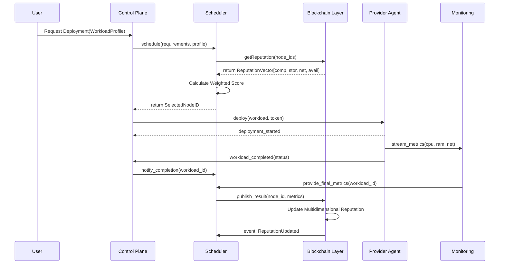

# Scheduling Sequence Diagram

```mermaid
sequenceDiagram
    participant U as User
    participant CP as Control Plane
    participant S as Scheduler
    participant BC as Blockchain Layer
    participant PA as Provider Agent
    participant M as Monitoring

    U->>CP: Request Deployment(WorkloadProfile)
    CP->>S: schedule(requirements, profile)
    S->>BC: getReputation(node_ids)
    BC-->>S: return ReputationVector[comp, stor, net, avail]
    S->>S: Calculate Weighted Score
    S-->>CP: return SelectedNodeID
    CP->>PA: deploy(workload, token)
    PA-->>CP: deployment_started
    PA->>M: stream_metrics(cpu, ram, net)
    PA->>CP: workload_completed(status)
    CP->>S: notify_completion(workload_id)
    M->>S: provide_final_metrics(workload_id)
    S->>BC: publish_result(node_id, metrics)
    BC->>BC: Update Multidimensional Reputation
    BC->>S: event: ReputationUpdated
```
